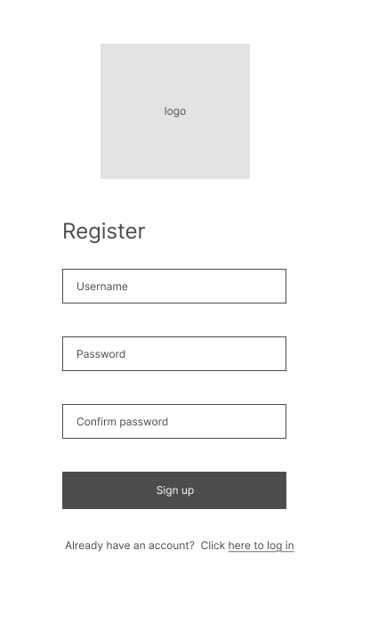
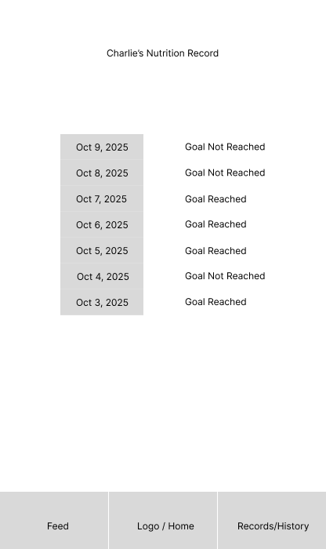

# User Experience Design

## App Map

---

## Authentication

### Log In
Let users access their account. It has the App Logo at the top. It allows users to type their username and password to log in, leading them to the home page. If they want, they can also use the Register link to go to register screen to register.

### Register
Let users create a new account. Users can fill the three fields: username, password, and confirmed password to create an new account, leading them to the home page. If they already have an account, they can use the Login link to go to the Log In screen.

---

## Home / Daily Experience

### Home Page
This is the main **dashboard**. It displays the pet image (linking to the Pet Page), a nutrition chart showing today’s intake, and navigation tabs for **Feed** and **Records/History**.

### Pet Page
This is the daily hub: see today's goals and status, and watch progress convert into the pet's XP (eat healthier → more XP → a stronger pet). From here, quickly navigate to **Home**, **Feed**, and **Records/History**.

---

## Feed (Rewards / Level-ups)

### Feed My Pet — Search
On this page, the user can search for food ingredients by name to view their nutritional facts (carbohydrates, protein, and fat per 100 g). A search bar allows users to quickly find ingredients and add them to their pet’s meal plan. 

### Feed My Pet — Ingredients
This page allows the user to enter the weight (in grams) of a selected ingredient and view its calculated nutritional values. Users can choose from similar ingredient variations and add items directly to their feeding list.

### Feed My Pet — Added
After adding an ingredient, this page confirms successful addition and provides options to add more ingredients or proceed to the intake summary. It helps reassure users that their input has been saved correctly.

### Detailed Records — Today
Detailed Records (Today) Page:
This page displays the pet’s daily nutritional intake summary, including calories, protein, carbs, and fat. Users can track progress toward daily goals through progress bars and a pie chart, as well as review detailed food entries with portion sizes and nutrient breakdowns.

---

## Records

### Detailed Records — History
This page contains the detailed nutrition data on a specific date. It includes detailed nutrient information, a list of intakes, and some visualization data.

### Archive
This contains the dates of the past week and a goal reaching status. By clicking on the data, the user will be able to go into a more detailed nutrition page on that specific date. 

---

## Profile & Settings

### User Page
This page displays the user's personal information, including their name, profile picture, and body metrics.

### Edit Info
On this page, the user can update or modify their personal and body information.

